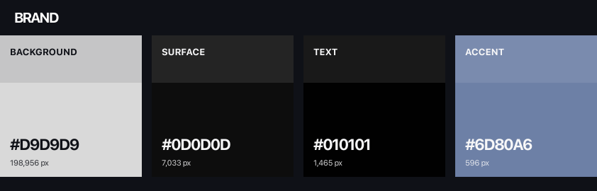
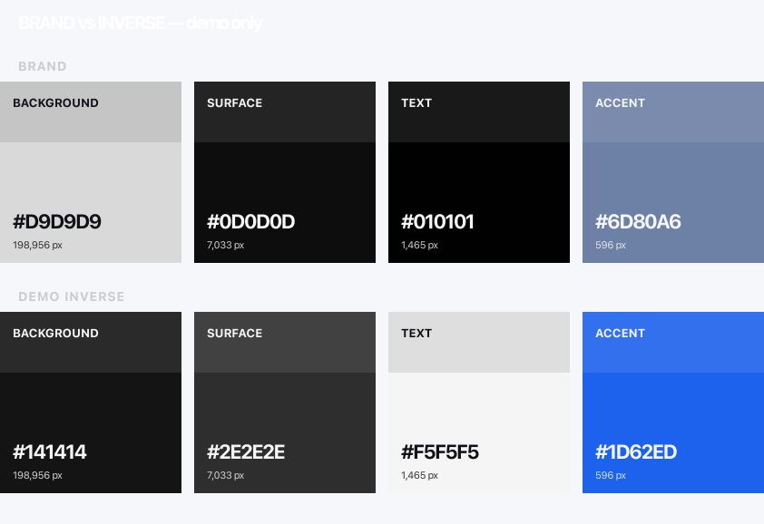
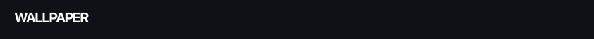
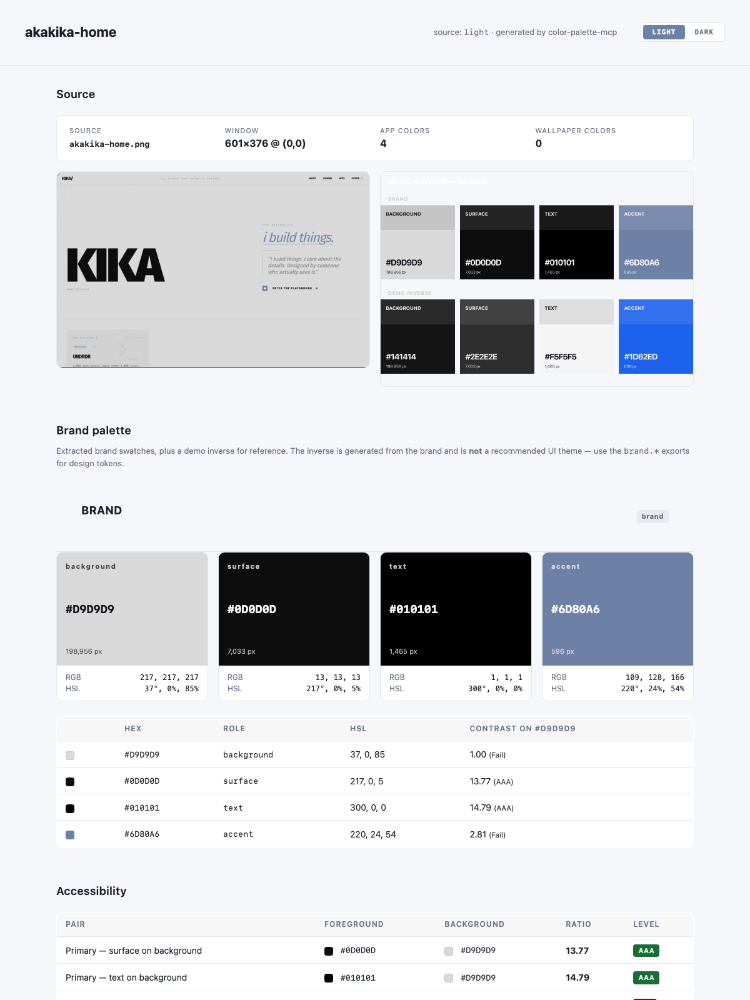

# akakika-home

Generated by **color-palette-mcp** on 2026-07-01.

> **Mode:** Brand palette (brand). The `demo-inverse` export below is generated for visual reference only — it shows what the brand looks like inverted; it is **not** a recommended UI theme. Use the `brand.*` exports for design tokens.

**Source mode:** `light` · **Brand mode:** on · **Primary theme:** `brand` · **Secondary theme:** `demo inverse`

## Source
- **File:** `akakika-home.png`
- **Detected window:** 601×376 at (0, 0)
- **Hash:** `3a147523`

## Brand palette

### BRAND (primary — matches source)
| Role | Hex | RGB | HSL | Population |
|---|---|---|---|---|
| background | `#D9D9D9` | 217, 217, 217 | 37°, 0%, 85% | 198,956 px |
| surface | `#0D0D0D` | 13, 13, 13 | 217°, 0%, 5% | 7,033 px |
| text | `#010101` | 1, 1, 1 | 300°, 0%, 0% | 1,465 px |
| accent | `#6D80A6` | 109, 128, 166 | 220°, 24%, 54% | 596 px |

### DEMO INVERSE
| Role | Hex | RGB | HSL |
|---|---|---|---|
| background | `#141414` | 20, 20, 20 | 0°, 0%, 8% |
| surface | `#2E2E2E` | 46, 46, 46 | 0°, 0%, 18% |
| text | `#F5F5F5` | 245, 245, 245 | 0°, 0%, 96% |
| accent | `#1D62ED` | 29, 98, 237 | 220°, 85%, 52% |

### BRAND vs DEMO INVERSE ΔE
- Mean ΔE2000: **7.88**
- Mean similarity: **0.921**

## Wallpaper (excluded from app)
| Role | Hex | Population |
|---|---|---|

## Accessibility
| Pair | FG | BG | Ratio | Level |
|---|---|---|---|---|
| Primary — surface on background | `#0D0D0D` | `#D9D9D9` | 13.77 | AAA |
| Primary — text on background | `#010101` | `#D9D9D9` | 14.79 | AAA |
| Primary — accent on background | `#6D80A6` | `#D9D9D9` | 2.81 | Fail |
| Secondary — surface on background | `#2E2E2E` | `#141414` | 1.36 | Fail |
| Secondary — text on background | `#F5F5F5` | `#141414` | 16.90 | AAA |
| Secondary — accent on background | `#1D62ED` | `#141414` | 3.53 | Fail |

## Files
- `source.png` — original image
- `app-window-cropped.png` — detected window
- `preview-brand.png` — brand palette swatches
- `preview-demo-inverse.png` — demo inverse (for preview only)
- `preview-wallpaper.png` — wallpaper swatches (if any)
- `preview-app-pair.png` — primary vs secondary side-by-side
- `preview-all.png` — combined view
- `index.html` — interactive design system guide (with dark/light toggle)
- `index.png` — screenshot of the design system guide
- `exports/` — palette in css_vars, scss, tailwind, json, figma_tokens formats

## Preview

